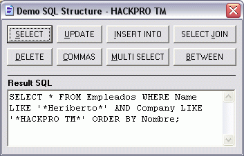



## Perfect SQL \(Update\)

### Description

You don't want to worry about the syntaxes of the sentences SQL, it proves with these custom

sentences.

Plz don`t vote for this, I upload again coz PSC remove the post when I try to update, sorry this.
 
### More Info
 

             |
---                |---
**Submitted On**   |2006-02-10 13:09:14
**By**             |[Heriberto Mantilla Santamaria](https://github.com/Planet-Source-Code/PSCIndex/blob/master/ByAuthor/heriberto-mantilla-santamaria.md)
**Level**          |Intermediate
**User Rating**    |5.0 (10 globes from 2 users)
**Compatibility**  |VB 5\.0, VB 6\.0
**Category**       |[String Manipulation](https://github.com/Planet-Source-Code/PSCIndex/blob/master/ByCategory/string-manipulation__1-5.md)
**World**          |[Visual Basic](https://github.com/Planet-Source-Code/PSCIndex/blob/master/ByWorld/visual-basic.md)
**Archive File**   |[Perfect\_SQ1979513112006\.zip](https://github.com/Planet-Source-Code/heriberto-mantilla-santamaria-perfect-sql-update__1-64618/archive/master.zip)

